<!-- hero: monochrome ASCII portrait (types in) beside a neofetch-style info
     panel. regenerate: ./scripts/build.sh  — see docs/PIPELINE.md -->
<table>
<tr>
<td valign="top"></td>
<td valign="top"></td>
</tr>
</table>

## Ajit Patel

**Software Engineer · AI/ML · Full-Stack**

<!-- social: shields for-the-badge (clickable) — matches portfolio / LinkedIn / GitHub chrome -->

 

<!-- animated SaaS tech stack: Simple Icons + staggered SMIL entrance
     edit data/tech_stack.yaml → ./scripts/build.sh --stack -->

 

<!-- animated contribution graph: real data, boxes reveal cell by cell
     (regenerated daily by .github/workflows/update-profile-art.yml) -->

